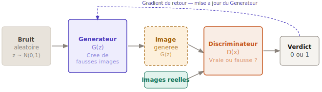
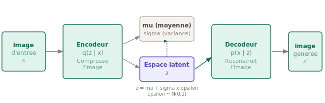
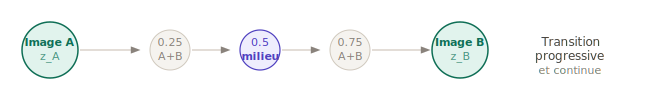
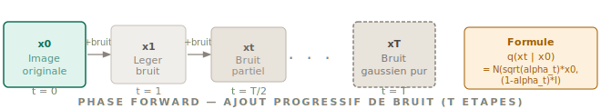
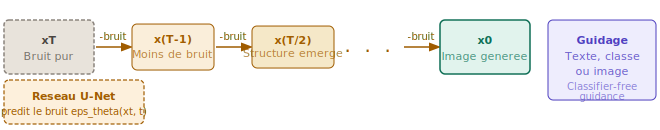
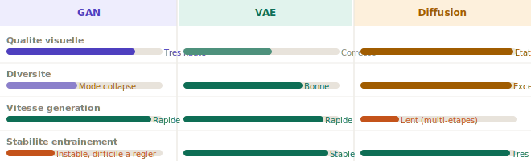

# Le Generative AI en Computer Vision — ELI5

> **ELI5 — Explain Like I'm 5**  
> GAN, VAE, Diffusion Models — comprendre les grandes architectures sans jargon.

---

## Table des matières

- [Introduction](#introduction)
- [Pourquoi utiliser le Generative AI ?](#pourquoi-utiliser-le-generative-ai-)
- [Les 3 grandes architectures](#les-3-grandes-architectures)
  - [GAN — Generative Adversarial Network](#gan--generative-adversarial-network)
  - [VAE — Variational Autoencoder](#vae--variational-autoencoder)
  - [Diffusion Models](#diffusion-models)
- [GAN, VAE, Diffusion — le match](#gan-vae-diffusion--le-match)
- [Conclusion](#conclusion)

---

## Introduction

Imagine que tu peux demander à un ordinateur de dessiner n'importe quoi — un visage, un paysage, une scène — sans que cette image existe déjà quelque part. C'est cela le Generative AI.

Dans le domaine de la Computer Vision, on distingue deux grandes familles de modèles. Les modèles **discriminatifs** regardent une image et la reconnaissent. Les modèles **génératifs** créent de nouvelles images réalistes à partir de ce qu'ils ont appris. C'est cette deuxième famille qui a révolutionné l'IA ces dernières années.

> **En une phrase :** Un modèle génératif ne se contente pas de comprendre les données — il apprend à en fabriquer de nouvelles qui ressemblent aux vraies.

### Des exemples concrets

| Cas d'usage | Description |
|---|---|
| **Visages synthétiques** | Générer des visages humains qui n'existent pas. Le site *thispersondoesnotexist.com* en est l'exemple le plus connu. |
| **Text-to-Image** | Écrire une description en langage naturel et l'IA génère l'image correspondante. Exemples : DALL·E, Midjourney, Stable Diffusion. |
| **Imagerie médicale** | Générer des IRM ou scanners artificiels pour enrichir les bases de données d'entraînement quand les vraies données sont rares. |
| **Super-résolution** | Prendre une image basse résolution et la rendre nette et détaillée. Utilisé en cinéma, surveillance et restauration photographique. |

---

## Pourquoi utiliser le Generative AI ?

Parce que les données réelles sont parfois rares, coûteuses ou impossibles à collecter — et que créer de nouvelles images ouvre des possibilités énormes.

1. **Augmenter les données (Data Augmentation)**  
   Un hôpital dispose de 100 IRM de tumeurs rares. Avec un modèle génératif, il peut en produire 10 000 — ce qui améliore significativement les performances du modèle de diagnostic.

2. **Améliorer la qualité d'images**  
   Transformer une photo floue ou pixelisée en image nette. Utilisé en restauration de films anciens, en retouche photo professionnelle et en caméras de surveillance.

3. **Création artistique et design**  
   Générer des logos, textures, personnages ou décors de jeux vidéo en quelques secondes. Les studios créatifs et les agences de design l'adoptent massivement.

---

## Les 3 grandes architectures

Il existe plusieurs façons d'apprendre à une machine à créer des images. Voici les trois approches fondamentales, expliquées le plus simplement possible.

---

### GAN — Generative Adversarial Network

*Ian Goodfellow, 2014*

> **Analogie :** Imagine un faussaire qui fabrique de faux billets de banque, et un détective qui essaie de les repérer. Les deux s'améliorent en permanence : plus le faussaire devient habile, plus le détective devient sévère. À la fin, les faux billets sont si parfaits que même le détective ne fait plus la différence.

Un GAN contient deux réseaux de neurones qui s'affrontent. Le **Générateur** crée de fausses images à partir de bruit aléatoire. Le **Discriminateur** examine chaque image et répond : "vraie" ou "fausse" ? À chaque itération, les deux s'améliorent ensemble — jusqu'à ce que le générateur produise des images indiscernables des vraies.

**Schèma : Architecture GAN**

> **Cas d'usage :** Génération de visages réalistes (StyleGAN), transfert de style artistique (CycleGAN), amélioration de résolution (SRGAN), création de personnages pour les jeux vidéo et le cinéma.

**Le problème du Mode Collapse :** Parfois, le générateur apprend à ne produire qu'un seul type d'image — celui qui trompe toujours le discriminateur. Il devient spécialiste d'une seule chose au lieu d'être diversifié, comme un faussaire qui ne sait fabriquer qu'un seul format de billet.

---

### VAE — Variational Autoencoder

*Kingma & Welling, 2013*

> **Analogie :** Imagine que tu lis un roman entier et que tu en gardes l'essentiel dans ta tête sous forme de quelques mots-clés. Quelques jours plus tard, tu utilises ces mots-clés pour réécrire une nouvelle version du roman — similaire à l'originale, mais pas identique. Le VAE fait exactement cela avec les images.

Un VAE fonctionne en deux étapes. L'**Encodeur** compresse l'image en un petit vecteur de nombres — c'est l'*espace latent*. Le **Décodeur** prend ce vecteur et reconstruit une image.

La grande idée : l'espace latent est continu et structuré. En déplaçant légèrement le vecteur, on obtient des images différentes mais cohérentes. On peut ainsi "naviguer" entre les concepts — passer progressivement d'un visage souriant à un visage neutre, ou d'un chat à un chien.

**Schèma : Architecture VAE — Pipeline complet**

**Schèma : Navigation dans l'espace latent — interpolation entre deux images**

> **Cas d'usage :** Génération d'images contrôlable, interpolation entre deux images, détection d'anomalies, compression intelligente, génération conditionnelle.

---

### Diffusion Models

*Ho, Jain & Abbeel, 2020 (DDPM)*

> **Analogie :** Imagine que tu verses une goutte d'encre dans un verre d'eau. Petit à petit, l'encre se diffuse et tout devient trouble. Maintenant imagine que l'on renverse le temps : on part de l'eau opaque et on reconstruit, étape par étape, la goutte d'encre d'origine. C'est exactement le principe du Diffusion Model.

Le modèle s'entraîne en deux phases. Dans la **phase forward**, on prend une image et on lui ajoute du bruit gaussien progressivement — jusqu'à obtenir du bruit pur. Dans la **phase backward**, le réseau apprend à inverser ce processus en enlevant le bruit étape par étape.

Pour générer une nouvelle image, on part de bruit aléatoire et on applique la phase backward. À chaque étape, une structure émerge progressivement jusqu'à obtenir une image cohérente et réaliste.

**Schèma : Phase Forward — ajout progressif de bruit**

**Schèma : Phase Backward — débruitage progressif par le réseau U-Net**

> **Cas d'usage :** Stable Diffusion, DALL·E 2 et 3, Imagen de Google, Midjourney. Ces modèles représentent aujourd'hui l'état de l'art en génération d'images — notamment pour le text-to-image.

**Le principal inconvénient** des Diffusion Models est leur lenteur : générer une image nécessite des dizaines ou centaines d'étapes de débruitage. Des variantes comme DDIM ou le LCM (Latent Consistency Model) réduisent ce nombre d'étapes pour accélérer la génération.

---

## GAN, VAE, Diffusion — le match

> *"Pas de modèle universel. Le meilleur choix dépend toujours du problème à résoudre."*

**Comparaison visuelle — qualité, diversité, vitesse, stabilité :**

| Critère | GAN | VAE | Diffusion |
|---|---|---|---|
| **Idée centrale** | Deux réseaux en compétition | Compression et reconstruction | Débruitage progressif |
| **Qualité visuelle** | ✅ Très haute | ⚠️ Correcte, parfois floue | ✅ État de l'art |
| **Diversité** | ⚠️ Mode collapse possible | ✅ Bonne | ✅ Excellente |
| **Vitesse de génération** | ✅ Rapide (1 passe) | ✅ Rapide (1 passe) | ❌ Lent (T étapes) |
| **Stabilité d'entraînement** | ❌ Instable, difficile | ✅ Stable | ✅ Très stable |
| **Contrôlabilité** | ⚠️ Difficile | ✅ Espace latent continu | ✅ Text-to-image natif |
| **Exemples célèbres** | StyleGAN, CycleGAN | beta-VAE, VQ-VAE | DALL-E, Stable Diffusion |
| **Quand l'utiliser** | Génération rapide, haute qualité visuelle | Navigation dans l'espace latent, interpolation | Meilleure qualité, génération guidée par texte |

---

## Conclusion

Trois architectures, trois philosophies complètement différentes. Mais toutes les trois poursuivent le même objectif : apprendre la structure cachée du monde visuel pour en créer de nouvelles représentations.

> **GAN :** Le faussaire contre le détective. Une rivalité productive qui produit des images d'une qualité visuelle exceptionnelle — mais dont l'entraînement reste capricieux et instable.

> **VAE :** Le résumé de roman. Une représentation comprimée, continue et navigable. Stable et contrôlable, idéal pour explorer l'espace des possibles — au prix d'une qualité visuelle parfois moins nette.

> **Diffusion :** Rembobiner le chaos. Apprendre à défaire le bruit étape par étape. Plus lent à l'inférence, mais aujourd'hui le champion incontesté en qualité d'image et en génération guidée par le langage naturel.

Le Generative AI évolue à une vitesse remarquable. En 2014, les GAN étaient une révolution. En 2020, les Diffusion Models ont tout changé. De nouvelles approches — comme les modèles de flux (Flow Matching) ou les architectures hybrides — commencent déjà à redéfinir l'état de l'art.

Comprendre ces fondations, c'est se donner les moyens de comprendre — et peut-être de contribuer à — ce qui vient.

---

*Rédigé dans le cadre du cours **Computer Vision & Generative AI** — Semestre 8*

`GAN` · `VAE` · `Diffusion Models` · `ELI5` · `Deep Learning`
